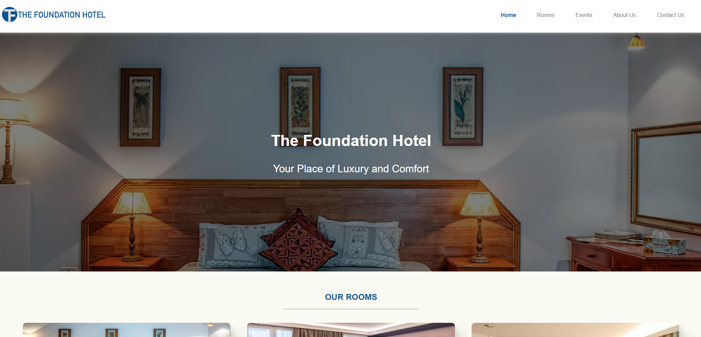
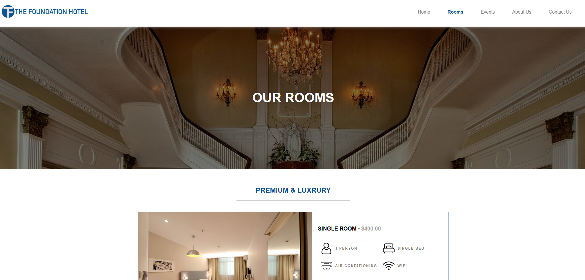
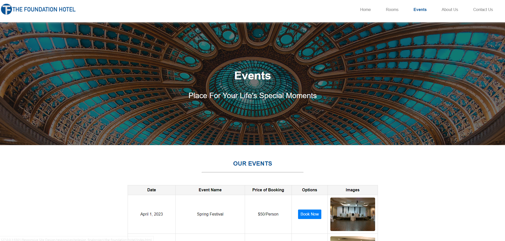
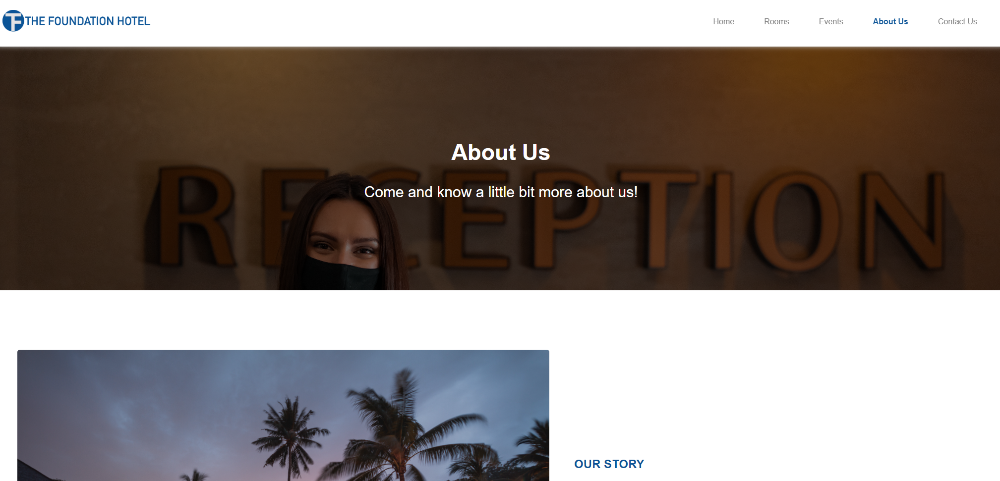
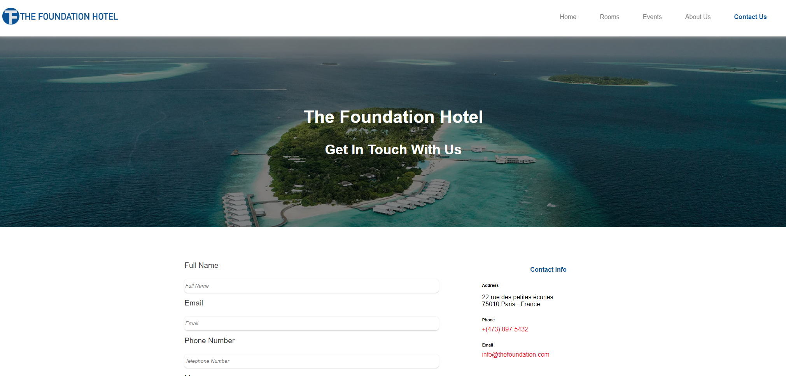

# 🏨 The Foundation Hotel - Website Project

## 📌 Project Overview

The **Foundation Hotel** website is designed to showcase the hotel’s services, rooms, events, and contact information through a visually appealing and responsive layout. This project was developed as a **final group project** in college, with a key requirement that all CSS styles be contained in a single file to ensure design consistency.

As part of this project, my primary contribution was the **About Us** page, which presents the history of the hotel, its staff, and its services.

---

## 🌍 Live Demo

🏨 **Try it out here**: [The Foundation Hotel Live Demo](https://the-foundation-hotel.vercel.app)

---

## 🚀 Features

- 🏡 **Home Page**: Overview of the hotel’s offerings and key services.
- 🛏 **Rooms Page**: Displays various room types with descriptions and pricing.
- 🎉 **Events Page**: Lists upcoming events with booking options.
- 📞 **Contact Page**: Contact form for inquiries and customer service details.
- ℹ **About Us Page**: Showcases the history, staff, and services of the hotel (**My Contribution**).
- 🎨 **Single CSS File**: Ensures consistent styling across all pages.
- 📱 **Fully Responsive Design**: Optimized for different screen sizes.

---

## 🛠 Technologies Used

- **🌐 HTML5**: Structure of the website.
- **🎨 CSS3**: Single stylesheet for maintaining design consistency.
- **📱 Responsive Web Design**: Ensures smooth adaptability across all devices.

---

## 📌 Project Purpose

This project demonstrates:

- **Web Development & UI Design**: Creating an elegant, user-friendly interface for a hotel website.
- **Consistent Styling**: Using a single CSS file to maintain uniform design across all pages.
- **User Experience Optimization**: Ensuring seamless navigation and clear presentation of hotel information.
- **Responsive Design Implementation**: Adapting layouts for mobile, tablet, and desktop screens.
- **Team Collaboration**: Dividing tasks efficiently and ensuring cohesive integration of each section.

---

## 📂 Project Structure

```
📝 foundation_hotel_project
 ├── 📝 css/                  # Stylesheets
 │   ├── index.css           # Single CSS file for the entire project
 ├── 📝 images/               # Image assets
 ├── 📝 js/                   # JavaScript files (if any)
 ├── 📝 webpages/             # Webpages for different sections
 │   ├── index.html          # Homepage
 │   ├── about-us.html       # About Us page (**My Contribution**)
 │   ├── rooms.html          # Hotel rooms page
 │   ├── events.html         # Hotel events page
 │   ├── contact.html        # Contact page
 │   ├── test.html           # Additional test page
 ├── 📝 favicon.ico           # Website icon
```

---

## 📌 Prerequisites

To view the website, ensure you have:

- A modern web browser (Chrome, Firefox, Edge, etc.).

---

## 🏃‍♂️ How to Run the Project

1️⃣ Open **index.html** in a web browser.

2️⃣ Navigate through the site using the menu.

---

## 🎯 My Contribution

For this project, I was responsible for developing:

- **About Us Page (about-us.html)**: Designed the layout and content.
- **Hotel History & Staff Section**: Showcased the hotel’s founding and team members.
- **Hotel Features Section**: Highlighted the services provided to guests.
- **Ensured seamless integration** with the overall design.

---

## 🖼 Screenshots

| Home Page | Rooms Page |
|-----------|-----------|
|  |  |

| Events Page | About Us | Contact Us |
|------------|---------|------------|
|  |  |  |

---

## 📝 License

This project was developed for educational purposes as part of a **college final project**.

---

## 💼 Author

👤 **Juan Jacobo Florez Monroy**  
🌐 **Portfolio**: [jjacobo95.com](https://jjacobo95.com)  
🐙 **GitHub**: [github.com/jjacoboflorez95](https://github.com/jjacoboflorez95)